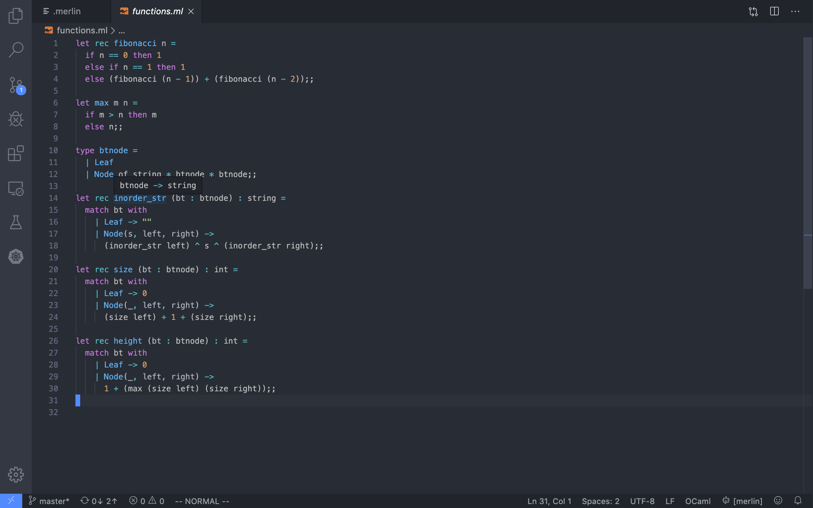

# PA0 – OCaml and Compiler Warmup

## Setup

### Install opam and OCaml

1. Install `opam`  ([OPAM](https://opam.ocaml.org/) is a package manager for OCaml)

   ```c++
   brew install gpatch opam
   ```

2. Initialize `opam` (May need clever trick in China)

   ```
   opam init
   ```

3. Install some other packages after setting up OCaml and OPAM

   ```ocaml
   opam install extlib ounit ocamlfind
   ```

4. Configure environment

   ```ocaml
    eval $(opam config env)
   ```

### Configure reason-ml plugin on vscode

1. On `vscode` plugin market, install `OCaml and Reason IDE`

2. Install merlin 

   ```
   opam install merlin
   ```

3. Configure in `settings.json`

   ```
   "reason.path.ocamlmerlin": "/Users/vic/.opam/default/bin/ocamlmerlin",
   "reason.path.refmt": "/Users/vic/.opam/default/bin/refmt",
   "editor.formatOnSave": true,
   "reason.path.ocpindent": "/Users/vic/.opam/default/bin/ocp-indent",
   "reason.path.opam": "/usr/local/bin/opam",
   "reason.path.ocamlfind": "/Users/vic/.opam/default/bin/ocamlfind"
   ```

4. Add `.merlin` file in current directory ([link](https://github.com/ocaml/merlin/wiki/project-configuration))

5. Cool `OCaml-vscode`
   

## Basic Programming in OCaml

`OCaml` files are written with `.ml` extension. (Similar to `Python`, since it will evaluate the file directly when running)

An `OCaml` file consists of 

- (Optionally) a series of `open` statements for including other modules
- A series of declarations for defining datatypes, functions and constants
- A series of (though often just one) top-level expressions to evaluate

### Hello world in OCaml

`hello.ml`

```ocaml
open Printf

let message = "Hello world";;
(printf "%s\n" message)
```

- The first line includes the built-in library for printing
- The next two lines define the message and print the message

Run the file with `ocaml`

```
ocaml hello.ml
```

### Define and calling functions

Define a `max` function

```ocaml
let max (n : int) (m : int) : int = 
  if n > m then n else m;;
```

In `C++` declaration

```c++
int max(int n, int m) {
	if (n > m) {return n;}
	else {return m;}
}
```

Difference

- `OCaml` have no `return` statement
- The declaration of `OCaml` end in `;;`
- The rule of single semicolon `;` is that they are evaluated in order, and the value resulting from each expression is ignored once it is done. 

The syntax of function call

- In `C++` => `max(4, 5)`
- In `OCaml` => `(max 4 5)`

`(max 4 5)` we can think it will be substituted by `if ` expressions

```
		(max 4 5)
=>	if 4 > 5 then 4 else 5
=>	5
```

### Recursive functions

`Ocaml` distinguishes between functions that can contain `recursive` calls and not. We need to define recursive functions by using `let rec`. 

Calculate the factorial of `n`

```ocaml
let rec factorial(n : int) : int = 
  if n <= 1 then 1
  else n * (factorial (n - 1));;
```

### Testing with OUnit

We will use a library called [OUnit](http://ounit.forge.ocamlcore.org/api-ounit/index.html) to write tests. 

With `OUnit`, we will write declarations in one file, and test them in another. 

- `functions.ml` the declarations of various functions
- `test.ml`  which will contain tests

A test in `OUnit` is a name paired with a function of one argument. And the test predicates most commonly used is `assert_equal`. 

The syntax `>::` is used to combine the name and the function together into a test. 

An example of test file

```ocaml
open OUnit2

let check_fn _ =
  assert_equal (2 + 2) 4;;

let my_first_test = "my_first_test">::check_fn;;

let suite = "suite">:::[my_first_test];;

run_test_tt_main suite
```

To build and run the given skeleton, we can use the Makefile to run the test

`Makefile`

```makefile
test: test.ml
	ocamlfind ocamlc -o test -package oUnit -linkpkg -g test.ml
	./test
```

We need to use `ocamlfind` that knows how to search your system for packages installed with e.g. OPAM. 

Run the test

```shell
$ make test
$ ./test
```

Another example of a failed test

```ocaml
let check_fn2 _ =
  assert_equal (2 + 3) 4;;

let my_second_test = "my_second_test">::check_fn2;;

let suite = "suite">:::[my_second_test];;
```

But however it doesn’t tell us much about the test information, we want more info. Notice that `assert_equal` has an optional argument that specifies how to turn the values under test into a string for printing. 

```ocaml
let t_int name value expected = name>::
  (fun _ -> assert_equal expected value ~printer:string_of_int);;

let my_third_test = t_int "my_third_test" (2 + 2) 7;;
let my_fourth_test = t_int "my_fourth_test" (2 + 2) 4;;

let suite = "suite">:::[
    my_third_test;
    my_fourth_test;
];;
run_test_tt_main suite
```

### Exercise

`fibonacci()` function and `max` function

```ocaml
let rec fibonacci n =
  if n == 0 then 1
  else if n == 1 then 1
  else (fibonacci (n - 1)) + (fibonacci (n - 2));;

let max m n =
  if m > n then m
  else n;;
```

`test.ml` for two above functions

```ocaml
open OUnit2
open Functions

let t_int name value expected = name>::
  (fun ctxt -> assert_equal expected value ~printer:string_of_int)

let suite =
"suite">:::
 [
   t_int "(fibonacci 2)" (fibonacci 2) 2;
   t_int "(fibonacci 3)" (fibonacci 3) 3;
   t_int "(fibonacci 4)" (fibonacci 4) 5;
   t_int "(max 2 3)" (max 2 3) 3;
   t_int "(max 100 98)" (max 100 98) 100;
 ]
;;

run_test_tt_main suite
```

## Datatypes

### Binary Tress with `type`

How to create new **datatypes** in `OCaml` and program with them.

Define binary tree nodes using keyword `type`

```ocaml
type btnode = 
	| Leaf
	| Node of string * btnode * btnode
```

An example of `btnode`

```ocaml
    "a"       Node("a",
   /   \        Node("b", Leaf, Leaf), Node("c", Leaf, Leaf))
"b"     "c"
```

Each position with no child corresponds to a `Leaf` and others correspond to uses of `Node`. We call `Leaf` and `Node` variants of the `btnode` *type*. (A `Leaf` is used here where you may have seen `NULL` in C++ implementation of a binary tree)

### Manipulating Data with `match`

An example of match

```ocaml
let m1 = match Node("a", Leaf, Leaf) with
	| Leaf -> "z"
	| Node(s, left, right) -> s;;
```

Substitution rules also work for understanding the `match`. 

If we want to write and `inorder_str` for the `btnode` 

```ocaml
let rec inorder_str (bt : btnode) : string =
  match bt with
    | Leaf -> ""
    | Node(s, left, right) ->
      (inorder_str left) ^ s ^ (inorder_str right)
```

###  Exercise

1. Write a test function `t_string` tests for equality of strings. 

   ```ocaml
   let t_str name value expected = name>::
       (fun ctxt -> assert_equal expected value ~printer: (fun x -> x));;
   ```

2. Write a function `size` that takes a `btnode` and produces an integer that is the number of `Node`s in the tree.

   ```ocaml
   let rec size (bt : btnode) : int =
     match bt with
       | Leaf -> 0
       | Node(_, left, right) ->
         (size left) + 1 + (size right);;
   ```

3. Write a function `height` that takes a `btnode` and produces an integer that is the height of the tree.

   ```ocaml
   let rec height (bt : btnode) : int =
     match bt with
       | Leaf -> 0
       | Node(_, left, right) ->
         1 + (max (size left) (size right));;
   ```

## List and Parametric Polymorphism

### Linked Lists, By Hand

A definition for the nodes of a linked list

```ocaml
type llist = 
	| Empty
	| Link of string * llist
```

That is, a list is either `Empty` , or a `Link` of a string onto another list. 
The natural solution is to make the datatype `generic` over the kind of data it uses. Type variables are written with a leading `‘` character. 

```
type 'a llist = 
	| Empty
	| Link of 'a * 'a llist
```

This describes a *homogeneous* list, where all elements will have the same type. 

```ocaml
let l1 = Link(1, Empty)
let l2 = Link("a", Empty)
```

Here, `l1` will have type `int list` and `l2` have type string list. 

### Linked Lists, Built-in

The built-in equivalent `Empty` is written `[]` and `Link(first, rest)` is written `first::rest`. And the syntax     `[a;b;c]` is shorthand for `a::b::c::[]`. The type of built-in list is `’a list` which can be specialized for any list contents. The `sum` function can be written as follows

```ocaml
let rec sum2 (l : int list) : int = 
  match l with 
    | [] -> 0
    | first :: rest -> first + sum2(rest);;
```

Some `OCaml` helper functions for list: [link](http://caml.inria.fr/pub/docs/manual-ocaml/libref/List.html)

### Exercises

1. Write and test a function `increment_all` that takes an `int list` and produces a new `int list` with all the elements increased by 1.

   ```
   let rec increment_all (l : int list) : int list = 
     match l with 
       | [] -> []
       | first :: rest -> (first + 1) :: (increment_all rest);;
   ```

2. Write and test a function `long_strings` that takes a `string list` and an `int` and produces a new `string list` that contains all the strings that had length greater than the given `int`. You can get the length of a string with the function `String.length`. Other string functions are documented [here](http://caml.inria.fr/pub/docs/manual-ocaml/libref/String.html).

   ```ocaml
   let rec long_strings (l : string list) (n : int) : string list = 
     match l with 
       | [] -> []
       | fisrt :: rest -> if (String.length fisrt) > n then fisrt :: (long_strings rest n)
                          else (long_strings rest n);;
   ```

3. Write and test a function `every_other` that takes a `'a list` (a list with elements of any one type), and produces a new list that contains every other element from the given list, starting with the first element.

   ```ocaml
   let rec every_other (l : 'a list) : 'a list = 
     match l with
       | [] -> []
       | first :: second :: rest -> first :: (every_other rest)
       | first :: [] -> [first];;
   ```

4. Write and test a function `sum_all` that takes an `int list list` (that is, a list of lists of integers), and returns an `int list` that contains the sums of the sub-lists.

   ```ocaml
    let rec sum_all (l : int list list) : int list = 
     match l with
       | [] -> []
       | first :: rest -> sum2(first) :: (sum_all rest);;
   ```

## Tuples

Sometime we want to return more than one value and `OCaml` has a built-in way of handling these cases called `tuples` . To create a tuple, we enclose two or more values in parentheses. 

```ocaml
let tup = (1, "a", []);;
```

And we can use a special kind of let binding, where we give names to the positions of a tuple value.

```ocaml
let tup = (1, "a", []);;
let (one, a, empty_list) = tup;
(*
	one is 1
	a is "a"
	empty_list is []
*)
```

And there are two built-in functions, `fst` and `snd`, that get the first and second component of a two-element tuple, respectively. 

```ocaml
let increment_snd (t : (string * int)) : (string * int) = 
  (fst t, 1 + (snd t));;
```

### Exercise

1. Implement and test a function called `sum_of_squares`, which takes a `(int * int) list` and produces a `int` that is the sum of the squares of the pairs in the list.

   ```ocaml
   let rec sum_of_squares (t : (int * int) list) : int = 
     match t with
       | [] -> 0
       | first :: rest -> (fst first) * (fst first) + 
                          (snd first) * (snd first) + 
                          sum_of_squares(rest);;
   ```

   

2. Implement and test a function called `remainders`, which takes a `int list` and a `int`, and produces a `(int * int) list`. The resulting list should contain the dividend and the remainder of dividing by the given number. For example, `(remainders [4; 6; 11] 3)` should produce `[(1, 1); (2, 0); (3, 2)]`

   ```c++
   let rec remainders (l : int list) (n : int) : (int * int) list =
     match l with
       | [] -> []
       | first :: rest -> (first / n, first mod n) :: (remainders rest n);;
   ```

## Option

We can raise exceptions with `failwith`. Sometimes, the failure of an operation is a reasonable outcome, and having a way to report a failure, or the absence of an answer, with a normal value rather than an exception is quire useful. 

If wrote the definition ourselves, the `option` would look like

```ocaml
type 'a option = 
	| None
	| Some of 'a
```

The first version of `find` function

```ocaml
let rec find (l : 'a list) (pred : 'a -> bool) : 'a = 
  match l with
    | [] -> failwith "Not found"
    | x::xs -> if pred x then x else find xs pred;;
```

The second version of `find` function

```ocaml
let rec find_opt (l : 'a list) (pred : 'a -> bool) : 'a option = 
  match l with
    | [] -> None
    | x :: xs -> if pred x then Some(x) else find_opt xs pred;;
```

### Exercise

1. Write and test a function `mean` which takes an `int list` and produces an `int option`, where it returns `None` if the list is empty, and a `Some` containing the mean of the numbers if it isn’t.

   ```ocaml
   let rec mean (l : int list) : int option = 
     match l with 
       | [] -> None
       | x :: xs -> Some((sum2 l) / (List.length l))
   ```

2. Write and test a function `list_max` which takes an `int list` and produces an `int option`, where it returns `None` if the list is empty, and a `Some` containing the largest element in the list if it isn’t empty.

   ```ocaml
   let rec list_max (l : int list) : int option = 
     match l with
       | [] -> None
       | x :: [] -> Some x
       | x :: xs -> Some (max x (Option.get (list_max xs)))
   ```

## Compiler

Implement a small compiler -> build up from scratch 

- Input: take a user program (a number)
- Output: create an executable binary that prints the number+

### The big picture

The heart of each compiler we write will be an OCaml program

- Input: program
- Output: assembly code

But there are few questions

- How will the input program be handed to, and represented in, OCaml?
- How will the generated assembly code be run?

### The wrapper

Our model for the code we generate is that it will start from a C-style function call

- We use a C program as the wrapper around our code
- We can defer some details to our C wrapper

```c++
#include <stdio.h>

extern int our_code_starts_here() asm("our_code_starts_here");

int main(int argc, char **argv) {
    int result = our_code_starts_here();
    printf("%d\n", result);
    return 0;
}
```

### Hello, x86

Our next goal is to

- Write an assembly program that defines `our_code_starts_here`
- Link that program with `main.c` and create an executable

We will generate 64-bit x86 assembly, and use the Intel syntax. 

```assembly
section .text
global our_code_starts_here
our_code_starts_here:
    mov rax, 37
    ret
```

### Hello, nasm

We will use `nasm` as our assembler, and it will take assembly (`.s`) files and turn them into object (`.o`) files that traditional compilers like `clang` or `gcc` can work with. 

```shell
nasm -f macho64 -o our_code.o our_code.s
```

This creates a file called `our_code.o` is `Execuutable and Linkable Format`

And finally it will compile it into a binary along with a C source file

```c++
clang -g -o our_code main.c our_code.o
```

Now we can run our code

```
./our_code
37
```

### Hello, compiler

Take the name of a file and output the compiled assembly code on standard output.
Here is a simple `compile.ml` that takes a file as a command line argument

```ocaml
open Printf

(* A very simple compiler - insert the given integer into 
the mov instruction at the correct place *)
let compile (program : int) : string = 
  sprintf "
section .text
global our_code_starts_here
our_code_starts_here:
  mov eax, %d
  ret\n" program;;

(* Some OCaml boilerplate for reading files and command-line arguments*)
let () = 
  let input_file = (open_in (Sys.argv.(1))) in
  let input_program = int_of_string (input_line input_file) in
  let program = (compile input_program) in
  printf "%s\n" program;;
```

And the `Makefile` this set of dependencies

```c++
%.run: %.o
	clang -o $@ main.c $<

%.o: %.s
	nasm -f macho64 -o $@ $<

%.s: %.int
	ocaml compile.ml $< > $@
```

And we can run the compiler

```shell
make 87.run
./87.run
```

Then we have a useful pipeline for getting from strings to assembly to a binary. 

## Reference

- [UCSD CSE131](https://ucsd-cse131-f19.github.io/pa0/#neonate)

- [NEU CS4410](https://course.ccs.neu.edu/cs4410/lec_neonate_notes.html)

- [Install Opam](https://opam.ocaml.org/doc/Install.html)

- [The .merlin file](https://github.com/ocaml/merlin/wiki/project-configuration)

- [Option](https://caml.inria.fr/pub/docs/manual-ocaml/libref/Option.html)

- [Executable and Linkable Format](https://en.wikipedia.org/wiki/Executable_and_Linkable_Format)

  