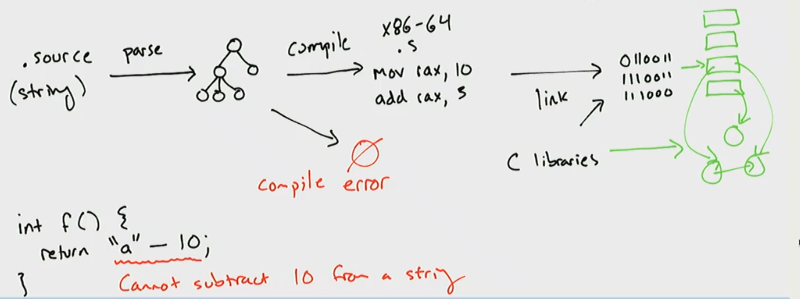

# Lecture 1

## What’s a compiler?

What a program is: it’s some *thing* that instructs a computer to do *something*.  Something must *translate* the source code of our programs into a form the computer understands. 

Usually there are two ways this could happen

- Write a program that takes the source code and *interprets* it on the fly
  - Downside: we need to keep both the source code and the interpreter around whenever we want to run the program
- Write a program that translates the source code of our program into machine language
  - Pros: we can just execute the resulting program directly

`Compiler: String -> String`

Specifically 

`Compiler: SourceProgram -> TargetProgram`

### Examples of compilers

What are **examples of compilers**?

- Javac
  - Input: `java` program
  - Output: bytecode, `.class` files, `.jar` files
- gcc
  - Input: `.c` file / string in `c` language / source code / high-level language
  - Output: Executable / Assembly / Compiled version of the `c` program
- Hotspot JIT compiler
- ghc
  - Input: `Haskell` program
  - Output: binary executable
- Rustc
  - Input: `Rust` program
  - Output: `binary` executable
- qbasic
  - Input: `Basic` program
  - Output: 16-bit DOS executable
- Clang: (similar as `gcc`)

-  Chicken Scheme compiler
  - Input: take scheme program
  - Output: produce binary as output

#### Other well-known compilers

```
gcc, clang : C          -> Binary          (* a.out, .exe *)
ghc        : Haskell    -> Binary
javac      : Java       -> JvmByteCode     (* .class *)
scalac     : Scala      -> JvmByteCode
ocamlc     : Ocaml      -> OcamlByteCode   (* .cmo *)
ocamlopt   : Ocaml      -> Binary
gwt        : Java       -> JavaScript      (* .js *)
v8         : JavaScript -> Binary
nasm       : X64        -> Binary
pdftex     : LaTeX      -> PDF
pandoc     : Markdown   -> PDF or Html or Doc
```

### Python has a compiler?

Lot’s of compilers produces executable files. 

No one mention python, or javascript. 

Why **not** python as a compiler?

- It is interpreted language (traditional thinking)
- `.pyc`  file

But actually there are somethings as `.pyc` file

Python program have two run routes

- Effects + output
- Also create `.pyc` file… (kind of compiler version (“somewhat” compiler version))

What’t the meaningful difference `.pyc` and `.class` files?

- Python bytecode (in the implementation of python)
- Actually a python compiler (takes python file -> produce the `.pyc` file)

### The broader definition of compiler

Any system take a program but produce other outputs?

- Typescript -> takes the input (Microsoft made) and produces javascript
  (Typescript compiler)

Compilers is not just for take program and produces executable. **Compiler is that takes program and produces more meaningful program**.

The produced program has some useful property or run on some other platform. 

Key requirements on output program

- Has the *same meaning* (“semantics”) as input
- Is *executable* in relevant context (VM, microprocessor, web browser)

## Overall picture

1. Input: source file (string)
2. Parse into tree data structures called an **Abstract Syntax Tree**
   - **Checked** to make sure code is well-formed
     Produce error message
- Move to the next step
3. Produce `.s` files (focus on in this class)
   (Generate x86-64 `.s`) 
   Modern languages used c library. Manage memory (C: malloc and free)
   (JAVA: garbage collection) 



Type declaration (recursive)

We will not write the linker, instead we use standard tool

Source language: made up for this course (nowadays big company made a language)

Six steps

- **Parsed** into a data structure called an Abstract Syntax Tree
- **Checked** to make sure code is well-formed (and well-typed)
- **Simplified** into some convenient Intermediate Representation
- **Optimized** into (equivalent) but faster program
- **Generated** into assembly **x64**
- **Linked** against a run-time (usually written in C)

### What we will learn

How to write a **compiler** for a small-is functional language to x64?

1. Parsing
2. Checking & Validation
3. Simplification & Normalizing
4. Optimization
5. Code Generation

But also, how to write **complex programs**

- Design
- Implement
- Test
- **Iterate**

Core principles of compiler construction

- Managing Stacks & Heap
- Type Checking
- Intermediate forms
- Optimization

Several new languages

- `Ocaml` to write the compiler
- `C` to write the “run-time”
- `x64` compilation target

More importantly `how to write a large program`

- How to use types of design
- How to add new features / refactor
- How to test & validate

## Ocaml

Use programming language `Ocaml` -> Really good for writing program work with trees

## Reference

- [NEU CS4410](https://course.ccs.neu.edu/cs4410/lec_intro_notes.html)
- [UCSD CSE131](https://ucsd-cse131-f19.github.io/lectures/09-26-lec1/notes.pdf)

