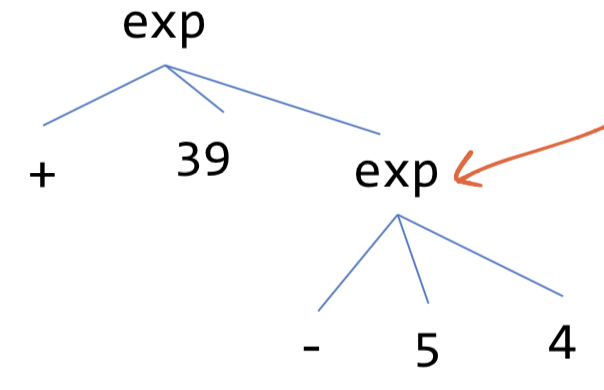

# Lecture 2

## Focus on parsing

Check out `Rust` language

 Today most focusing on parsing 

- Compiler courses more than two weeks (when talk about parsing)
  (Very frontend of the compiler)
- But I don’t do that…
  (There are much resource about parsers and many useful tools!)

131 like a backend compiler courses and only a quick look at parsing

Our goal is: solving precedence is not interesting

## `s-expression`

Example: `(+ 39 (- 5 4))` 

Make parsing that very easy -> idea called `s-expression` 
(Every expression will have `()` and no need to consider the operator precedence) 

Tokenize: `string -> string list`


Parse: `string list -> Sexp`

Ever seen the syntax before?

- The lisp
- Racket
- Scheme

No question and very regular => easy to parse

## Data formats in a programming course

- Json: lots of curly braces (very common)
  - Being used as configuration files
- Xml: have really many attributes (looks like `html`)
  - Serialize data format
  - Hard to read
- The source code of programming language
  - Another serialize data format
  - Reasonable to write programs

Not universally, there are programming languages that takes source language (web assembly) into `s-expression`. 

## High-level intuition

- The first step
  - From string to list of strings: based on how we define token
  - Reduce spacing..
  - Tokens (number tokens, operators, `()`) 
  - Token -> regular expression (map operators, digits, `()`) 

- The second step: parse (take string list into some kind of trees)
  - No `()` in my trees (the tree is useful)
  - All `()` is captured in the tree structure
  - Figure out what need to be a subtree?
  - Insight: into flat list into trees -> write recursive function

There is a library for `s-expressions` since they are very common. 

You may never need to implement your self. 

In `ocaml`, there is a library called `sexplib`

```ocaml
type Sexp.t = 
	| List of Sexp.t list
	| Atom of string

let l = List([Atom("+"); Atom("39"); List([Atom("-"); Atom("5"); Atom("4")])])
```



It is the input of our compiler `Sexp.of_string` : `string` -> `Sexp.t`

## A more complicated compiler

```ocaml
open Printf
open Sexplib.Sexp
module Sexp = Sexplib.Sexp

(*
expr := <number>
    | (<op> <expr>)
op := inc | dec
*)

type op = 
    | Inc
    | Dec

type expr = 
    | ENum of int 
    | EOp of op * expr (*EOp has a op and an expr *)

let rec sexp_to_expr (sp : Sexp.t) : expr = 
    match sp with
        | Atom(s) -> ENum(int_of_string s)
        | List(sexps) -> 
            match sexps with
                | [Atom("inc"); arg] -> EOp(Inc, sexp_to_expr arg)
                | [Atom("dec"); arg] -> EOp(Dec, sexp_to_expr arg)
                | _ -> failwith "Parse Error!"

let parse (s : string) : expr = 
    sexp_to_expr (Sexp.of_string s)

let rec expr_to_instrs (s : expr) : string list = 
    match s with
        | ENum(i) -> [sprintf "mov rax, %d" i]
        | EOp(op, e) -> 
            let arg_exprs = expr_to_instrs e in 
            match op with
                | Inc -> arg_exprs @ ["add rax, 1"] (* append lists *)
                | Dec -> arg_exprs @ ["sub rax, 1"]

let compile (program : string) : string = 
    let ast = parse program in
    let instrs = expr_to_instrs ast in
    let instrs_str = (String.concat "\n" instrs) in
    sprintf "
    section .text
    global our_code_starts_here
    our_code_starts_here:
        %s
        ret\n
    " instrs_str;;

let () = 
    let input_file = (open_in (Sys.argv.(1))) in
    let input_program = (input_line input_file) in
    let program = (compile input_program) in
    printf "%s\n" program
```

And it will have following effects: get the answer into `EAX`

```
																									mov rax, 4
(inc (dec 4)) -> EOp(Inc, EOp(Dec, ENum(4))) -> 	sub rax, 1
																									add rax, 1
```

## Add variable to the grammar

Now, the context free grammar
```ocaml
(* expr := <number>
        | (<op> <expr>)
        | (let (<name> <expr>) <expr>)
        | <name> *)

type op = 
  | Inc
  | Dec

type expr = 
  | ENum of int
  | EOp of op * expr
  | ELet of string * expr * expr
  | EId of string
```

## Reference

1. [NEU CS4410](https://course.ccs.neu.edu/cs4410/lec_let-and-stack_notes.html)